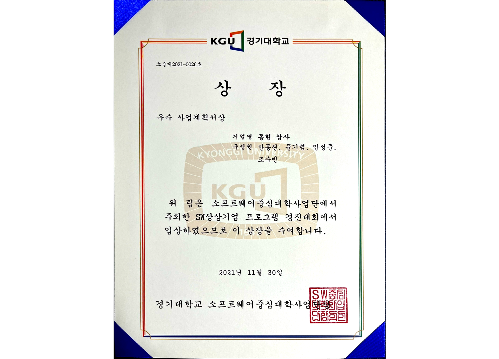
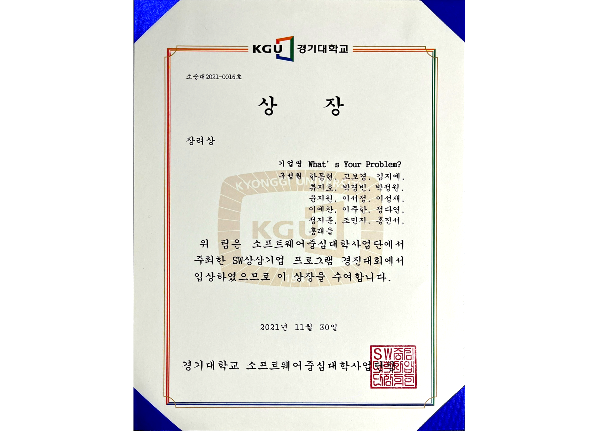
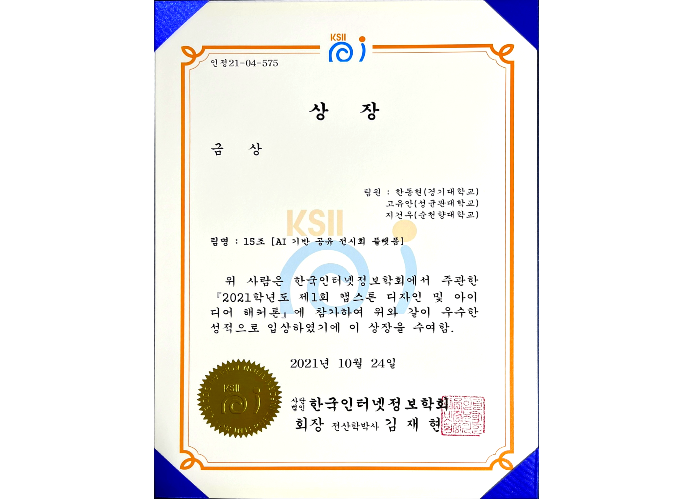
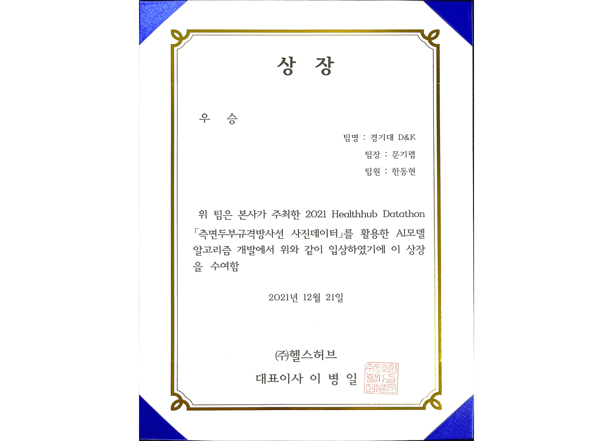
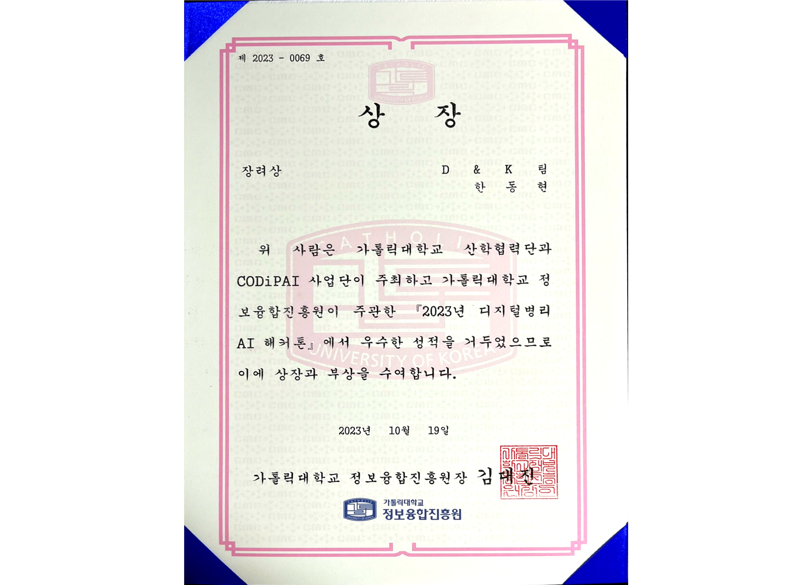

# 🌑 Dong-Hyun Han 

 

🌟 M.S in Conputer Science (Kyonggi Univ.)
 

    
🌒 Topics:

   

- Geospatial AI
- Generative Models
- Self-Supervised Learning

    
🌓 Experience:

 

-  &nbsp; &nbsp; &nbsp; &nbsp; &nbsp; &nbsp; &nbsp; &nbsp; &nbsp; &nbsp; B.S, Computer Engineering, Kyonggi University (KGU) (Mar. 2017 - Feb. 2023)  
-  한국전자통신연구원 (ETRI) Research Trainee (Jul. 2022 - Aug. 2022)  
-  &nbsp; &nbsp; &nbsp; &nbsp; &nbsp; &nbsp; &nbsp; &nbsp; &nbsp; &nbsp; M.S, Computer Science, Kyonggi University (KGU) (Mar. 2023 - )  

  

    
🌔 Skills: 

 
&nbsp;
<code></code>
<code></code>
<code></code>
<code></code>
<code></code>
<code></code>
<code></code>
<code></code>
<code></code>
<code></code>
<code></code>
<code></code>
<code></code>

    
🌕 Awards:

 

|

|

|

|  
|:---:|:---:|:---:|
|
교내 프로그래밍 경진대회  🏅 우수상 (Jun. 2017)
|
교내 SW상상기업 프로그램경진대회 🏅 우수사업계획서상 (Nov. 2021)
|
교내 SW상상기업 로그램경진대회 🏅 장려상 (Nov. 2021)
|  

  

|

|

|

|

|  
|:---:|:---:|:---:|:---:|
|
한국인터넷정보학회 캡스톤 디자인 및 아이디어 해커톤 🏅 금상 (Oct. 2021)
|
과학기술정보통신부 공개 SW 개발자대회 🏅 은상 (Nov. 2021)
|
(주) HealthHub 2021 Healthhub DataThon 🏅 우승 (Dec. 2021)|
한국정보기술학회(KIIT) 대학생 논문 경진대회 🏅 동상 (Jun. 2022)
|

|

|  
|:---:|
|
가톨릭대학교 정보융합진흥원 2023 디지털 병리 AI 해커톤 🏅 장려상 (Oct. 2023)
|

 

    
🌖 Papers:

   

Domestic Publications

- 한국인터넷정보학회, 심층 신경망을 이용한 GP 기반 소아 골연령 측정 (한동현, 문기렴, 이병대) (Oct. 2021)  
- 한국정보기술학회, 세포 계수 측정을 위한 딥러닝 기반 객체탐지 시스템 연구 개발 (한동현, 김민종, 김태강, 박준후, 조수빈, 김상진) (Jun. 2022)  
- 한국통신학회, 인간 자세 추정을 위한 경량화 딥러닝 알고리즘 개발 (노원준, 문기렴, 한동현, 이병대) (Feb. 2023)  
- 한국인터넷정보학회, 그림자 제거를 위한 깊은 그림자 특징 개선 네트워크 (한동현, 이병대) (Mar. 2023)  
- 한국인터넷정보학회, 평발 진단을 위한 딥러닝 기반 방사선적 지표 자동 측정 시스템 (노원준, 문기렴, 한동현, 이병대) (Sep. 2023)  

  

---

   

- Contact: mpolio2@kyonggi.ac.kr  
- Blog: [우물안 개구리](https://donghyun99.tistory.com/16)  